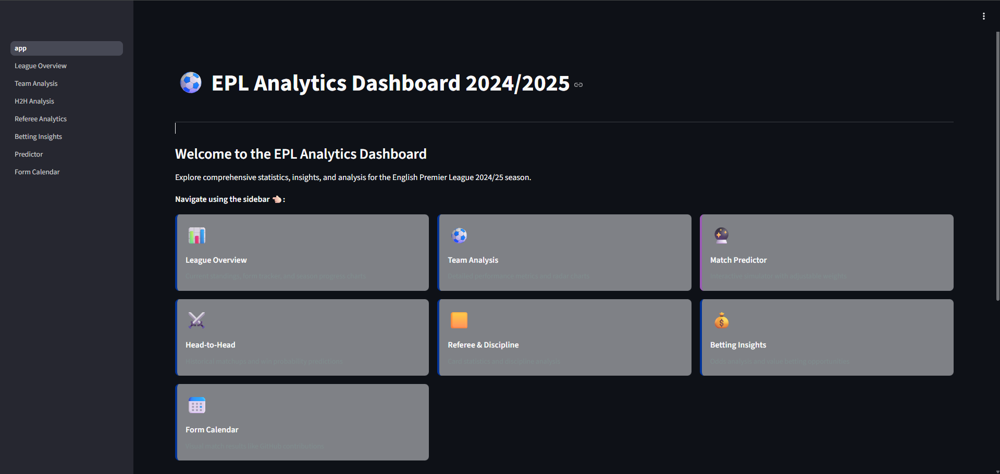
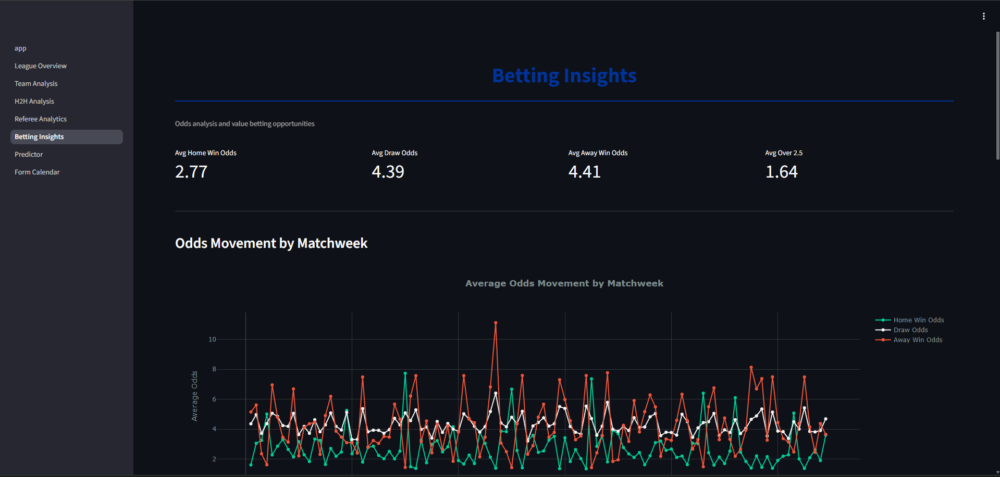
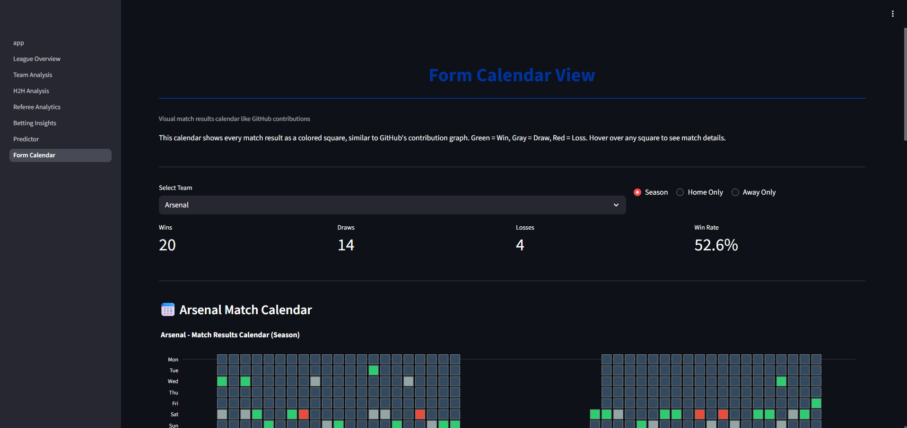
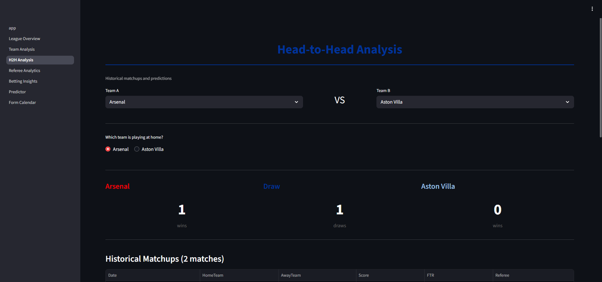
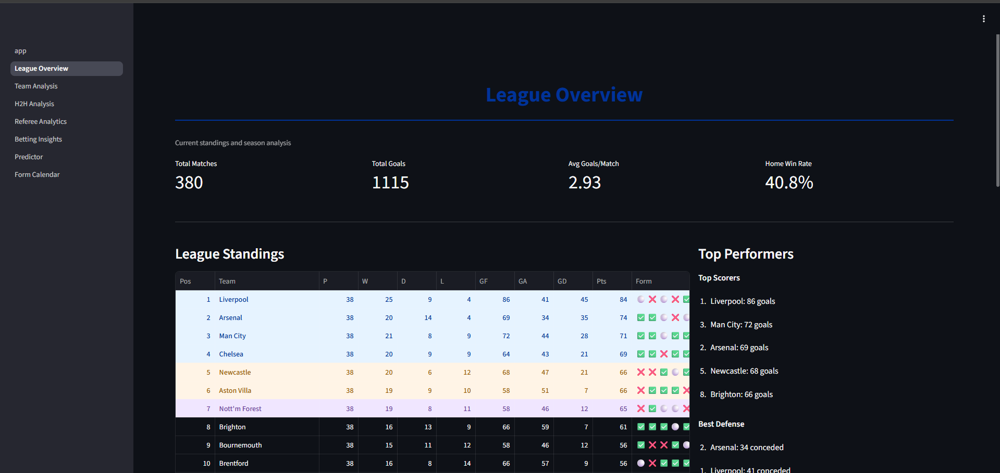
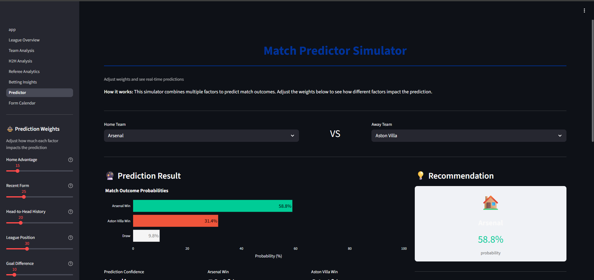
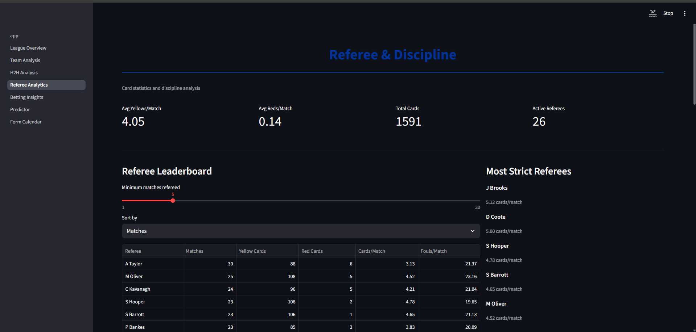
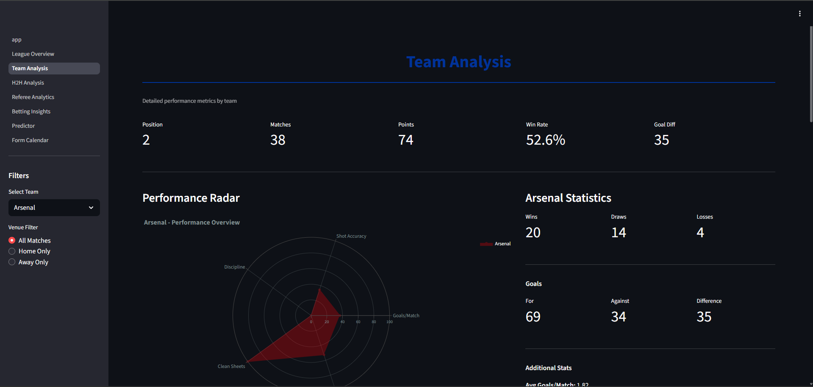

# EPL 2024/2025 Analytics Dashboard

A comprehensive interactive dashboard for analyzing English Premier League 2024/25 season data, featuring team performance metrics, head-to-head analysis, referee statistics, and betting insights.











## Features

### 📊 League Overview
- Live standings table with form indicators
- Top performers (scorers, defense, momentum)
- Season progress tracking

### ⚽ Team Analysis
- Detailed team performance metrics
- Shot efficiency analysis
- Home vs Away comparison
- Recent form timeline

### ⚔️ Head-to-Head Analysis
- Historical matchup data
- Win probability calculator
- Prediction confidence indicators

### 🟨 Referee & Discipline
- Referee leaderboard
- Card distribution heatmap
- Fouls vs results correlation

### 💰 Betting Insights
- Odds movement tracking
- Over/Under 2.5 goals analysis
- Value bet detector
- Bookmaker comparison

## Installation

### Prerequisites
- Python 3.10 or higher
- pip package manager

### Setup

1. Clone the repository:
```bash
git clone https://github.com/yourusername/BetLogic-EPL-Dashboard.git
cd BetLogic-EPL-Dashboard
```

2. Create a virtual environment:
```bash
python -m venv venv
source venv/bin/activate  # On Windows: venv\Scripts\activate
```

3. Install dependencies:
```bash
pip install -r requirements.txt
```

4. Run the dashboard:
```bash
streamlit run app.py
```

## Data Source

This dashboard uses EPL 2024/25 season data from [Football-Data.co.uk](http://www.football-data.co.uk/).

## Project Structure

```
BetLogic-EPL-Dashboard/
├── dataset/              # CSV data files
├── src/                  # Source code
│   ├── constants.py      # Configuration constants
│   ├── data_loader.py    # Data loading utilities
│   ├── features.py       # Feature engineering
│   └── visualizations.py # Chart functions
├── pages/                # Streamlit multi-page components
├── tests/                # Unit tests
├── assets/               # Images, logos, etc.
├── .gitignore
├── README.md
├── requirements.txt
├── plan.md              # Detailed project plan
└── app.py               # Main application entry point
```

## Development

### Running Tests
```bash
pytest tests/
```

### Code Style
This project follows PEP 8 guidelines. Format code with:
```bash
black src/ tests/
```

## Deployment

The dashboard is deployed on Streamlit Cloud: [Link to be added]

## Roadmap

See [plan.md](plan.md) for detailed implementation roadmap and future enhancements.

## Contributing

Contributions are welcome! Please feel free to submit a Pull Request.

## License

This project is licensed under the MIT License.

## Acknowledgments

- Data provided by [Football-Data.co.uk](http://www.football-data.co.uk/)
- Built with [Streamlit](https://streamlit.io/)
- Visualizations powered by [Plotly](https://plotly.com/)

---

**Version:** 1.1 (Data-Verified)
**Last Updated:** January 2026
